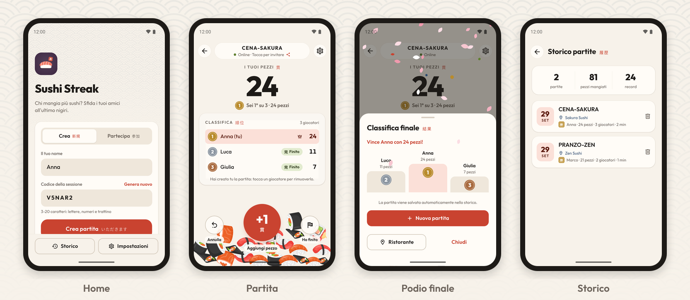
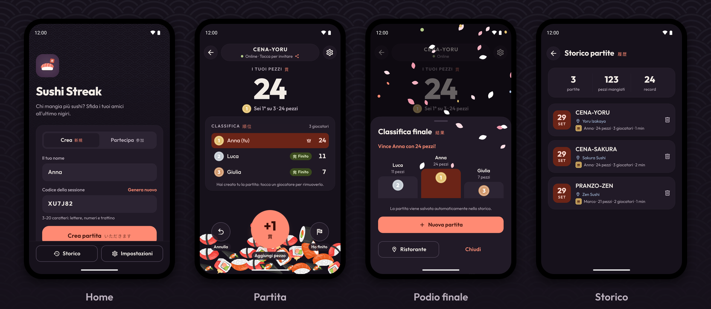

<p align="center">
  
</p>

<h1 align="center">Sushi Streak</h1>

<p align="center">
  <strong>Chi mangia più sushi? Sfida i tuoi amici all'ultimo nigiri.</strong><br>
  L'app per Android e iOS che conta in tempo reale i pezzi mangiati durante una cena all-you-can-eat,<br>
  con classifica condivisa, una pila di sushi che cresce a ogni pezzo e un tocco di stile giapponese.
</p>

<p align="center">
  <a href="https://github.com/Stevatero/sushi-streak-game/actions/workflows/ci.yml"></a>
  <a href="CHANGELOG.md"></a>
  
  
  
  <a href="LICENSE"></a>
</p>

<p align="center">
  
</p>

---

## Indice

- [Scarica l'app](#scarica-lapp)
- [Funzionalità](#funzionalità)
- [Come si gioca](#come-si-gioca)
- [Design](#design)
- [Stack tecnologico](#stack-tecnologico)
- [Architettura](#architettura)
- [Struttura del progetto](#struttura-del-progetto)
- [Sviluppo locale](#sviluppo-locale)
- [Configurazione](#configurazione)
- [Qualità: test, lint e formattazione](#qualità-test-lint-e-formattazione)
- [Versioni, build e rilasci](#versioni-build-e-rilasci)
- [CI/CD](#cicd)
- [Sicurezza e privacy](#sicurezza-e-privacy)
- [Roadmap](#roadmap)
- [Licenza e crediti](#licenza-e-crediti)

## Scarica l'app

L'app non è ancora su Google Play né sull'App Store. Su Android per provarla c'è l'**APK di test** (variante _preview_, si installa accanto a un'eventuale versione del Play Store come "Sushi Streak (Preview)"):

| APK                                    | Per chi                              | Link fisso all'ultima build                                                                                                                                |
| -------------------------------------- | ------------------------------------ | ---------------------------------------------------------------------------------------------------------------------------------------------------------- |
| Solo arm64 (consigliato, ~34 MB)       | Telefoni Android degli ultimi anni   | [sushi-streak-preview-arm64.apk](https://github.com/Stevatero/sushi-streak-game/releases/download/apk-preview-latest-arm64/sushi-streak-preview-arm64.apk) |
| Completo (arm64 + armeabi-v7a, ~48 MB) | Anche telefoni meno recenti a 32 bit | [sushi-streak-preview.apk](https://github.com/Stevatero/sushi-streak-game/releases/download/apk-preview-latest/sushi-streak-preview.apk)                   |

Le build per versione sono nelle [release](https://github.com/Stevatero/sushi-streak-game/releases) `apk-preview-vX.Y.Z`.

**Come installarlo**

1. Apri il link dal telefono con **Chrome** (non dal browser interno di altre app, che spesso non salva gli `.apk`).
2. Chrome avvisa che il file può essere dannoso: tocca **Scarica comunque**. Senza questa conferma il download arriva al 100% ma il file non viene salvato.
3. Apri il file dalla notifica di download o da **File → Download**.
4. Se richiesto, consenti a Chrome (o all'app File) di **installare app sconosciute**; se Play Protect avvisa, scegli **Installa comunque**.

> L'APK di test è firmato con una chiave di debug: va bene per provare l'app, ma non aggiorna una versione installata dal Play Store. Una nuova build della stessa variante si installa invece come aggiornamento della precedente.

**iPhone**: l'app è pronta per iOS (stesso codice e stesse funzioni) e si compila con EAS; per installarla su un iPhone serve un account Apple Developer (vedi [docs/RELEASING.md](docs/RELEASING.md#ios-app-store)).

## Funzionalità

**Partite multigiocatore in tempo reale**

- Crea una partita con un codice (generato o personalizzato) e invita gli amici con codice o link (`https://sushi.dietalab.net/join/CODICE`); il pulsante **Incolla** riconosce anche un link di invito copiato.
- Classifica condivisa aggiornata in tempo reale via WebSocket, con la tua posizione e il tuo punteggio in grande.
- **+1** per ogni pezzo mangiato, con suono, animazione e una pila di sushi che cade e si accumula con una fisica simulata sul thread UI: fluida anche con decine di pezzi. **Annulla** corregge un tocco accidentale: l'ultimo pezzo svanisce dalla pila con un "bop".
- Chi crea la partita (👑) può rimuovere un giocatore toccandolo in classifica, per esempio chi è entrato indovinando il codice.
- **Ho finito** (con una conferma che riepiloga pezzi e posizione): la partita termina quando tutti hanno finito, con podio, classifica finale, pareggi gestiti e una pioggia di petali di ciliegio per chi vince.
- Pagina web di invito con la stessa grafica dell'app, che apre l'app o porta allo store se non è installata (Google Play su Android, App Store su iPhone quando sarà pubblicata).
- Conferme e avvisi in pannelli nello stile dell'app, uguali su Android e iOS.

**Affidabilità**

- Riconnessione automatica dopo cadute di rete o il ritorno dall'app in background, con indicatore dello stato di connessione.
- Partita riprendibile dalla Home anche dopo la chiusura forzata dell'app o un riavvio del server.
- Le partite restano aperte fino a 3 ore senza attività (configurabile).

**Storico e preferenze**

- Salvataggio automatico delle partite sul dispositivo, con durata, ristorante facoltativo e un riepilogo (partite, pezzi mangiati, record).
- Tema sistema/chiaro/scuro e suoni attivabili, con preferenze salvate.
- Cancellazione dei dati locali e informativa privacy dalle Impostazioni.

L'app non richiede registrazione e non contiene pubblicità, analytics o tracciamento.

## Come si gioca

1. Un giocatore apre **Crea**, sceglie il proprio nome e tocca **Crea partita**, poi invita gli altri con il link o il codice.
2. Gli altri aprono il link, oppure in **Partecipa** incollano o scrivono il codice.
3. Ognuno tocca **+1** per ogni pezzo mangiato: la classifica si aggiorna per tutti e la pila di sushi cresce.
4. Quando hai finito tocca **Ho finito**; quando tutti hanno finito compaiono il podio e il vincitore, e la partita finisce nello storico.

## Design

<p align="center">
  
</p>

Un'interfaccia fresca e moderna con un richiamo discreto al Giappone:

- **Colori tradizionali**: carta _washi_ e seta grezza _kinari_ per le superfici chiare, inchiostro _sumi_ per il testo, vermiglione _shu_ (il colore dei timbri e dei torii) come colore principale, indaco _ai_ e _matcha_ come accenti. Il tema scuro _yoru_ (notte) riprende il prugna dell'icona e dello splash.
- **Timbri _hanko_** per il logo, le posizioni in classifica (oro, argento, bronzo) e la vittoria; motivo a onde **_seigaiha_** sullo sfondo; petali di ciliegio (_sakura fubuki_) per festeggiare.
- **Tipografia** con il font [Outfit](https://fonts.google.com/specimen/Outfit) e piccole didascalie in giapponese:

| Parola       | Lettura         | Dove                    | Significato                              |
| ------------ | --------------- | ----------------------- | ---------------------------------------- |
| 寿司         | sushi           | logo                    | sushi                                    |
| 貫           | kan             | punteggio, pulsante +1  | unità con cui si contano i pezzi         |
| いただきます | itadakimasu     | Crea partita            | "buon appetito", detto prima di mangiare |
| ごちそうさま | gochisōsama     | fine dei propri pezzi   | "grazie per il pasto", detto alla fine   |
| 順位         | jun'i           | classifica              | posizione                                |
| 勝           | shō / kachi     | vincitore               | vittoria                                 |
| 完           | kan             | giocatore che ha finito | completato                               |
| 帰 / またね  | kaeru / mata ne | uscita dalla partita    | "tornare" / "a presto"                   |

Il design system è in `sushi-game-app/src/theme/theme.ts` (palette, tipografia, temi Material 3) e `src/components/ui/` (pulsanti, pannelli, campi, pannelli dal basso, conferme, timbri, motivo a onde).

## Stack tecnologico

| Componente       | Tecnologie                                                                                     |
| ---------------- | ---------------------------------------------------------------------------------------------- |
| App              | Expo SDK 57, React Native 0.86 (New Architecture, Hermes), React 19.2, TypeScript 6 strict     |
| UI e navigazione | Design system proprio su React Native Paper (Material 3), React Navigation 7, Reanimated 4     |
| Animazioni       | Motore fisico della pila di sushi scritto come worklet sul thread UI; festa con petali animati |
| Stato e dati     | Zustand, AsyncStorage, Socket.IO client                                                        |
| Backend          | Node.js ≥ 20, Express 4, Socket.IO 4, SQLite (`sqlite3`), Helmet                               |
| Qualità          | Jest + Testing Library, node:test, ESLint, Prettier, TypeScript                                |
| Delivery         | EAS Build/Submit, GitHub Actions (CI, release, APK di test), Dependabot, PM2 + nginx           |

## Architettura

```
┌──────────────────────────── App (Expo / React Native) ────────────────────────────┐
│ Screens (Home, Partita, Storico, Impostazioni) + design system (theme, ui/)       │
│   ├── gameStore (Zustand) ◀── socketService ── riconnessione, rejoin, ack/timeout │
│   ├── api (REST, timeout, errori tipizzati)                                       │
│   ├── sessionStorage / preferences (AsyncStorage, dati validati)                  │
│   └── SushiStack ── fisica worklet sul thread UI (Reanimated frame callback)      │
└───────────────┬───────────────────────────────────────────────┬───────────────────┘
                │ HTTPS  POST /api/sessions, /join, GET /info   │ WSS  join_session, add_piece, remove_piece,
                ▼                                               ▼      player_finished, kick_player
┌──────────────────────────── Backend (Node.js) ────────────────────────────────────┐
│ Express (validazione, rate limit, Helmet/CSP) · Socket.IO (auth con token)        │
│ Stato partite in memoria + persistenza SQLite · modifiche serializzate per giocatore│
│ Chiusura e pulizia automatiche · Pagine web: /join/:codice, /privacy · /api/health │
└────────────────────────────────────────────────────────────────────────────────────┘
```

- Il server è la fonte di verità della partita; il client applica gli snapshot ricevuti (`session_update`, `game_ended`, `session_expired`, `player_kicked`).
- Ogni giocatore riceve `playerId` + `playerToken` alla creazione/ingresso: il socket si autentica con questi e le azioni valgono solo per il giocatore autenticato. Chi crea la partita è l'host (`hostId`) e può rimuovere gli altri giocatori.
- Le modifiche di ogni giocatore passano da una coda: si scrive prima su SQLite e poi in memoria, senza perdere tocchi ravvicinati. Dopo un riavvio le partite vengono ricaricate dal database.
- **Pila di sushi**: ogni pezzo è un cerchio in un piccolo motore fisico (Verlet a passo fisso, attrito di Coulomb, pezzi a riposo statici) eseguito nel frame callback di Reanimated. I pezzi leggono la posizione direttamente dallo stato condiviso, senza render React per frame; quando la pila è ferma la simulazione si spegne.

## Struttura del progetto

```
sushi-streak-game/
├── sushi-game-app/              App Expo (Android e iOS)
│   ├── App.tsx                  Provider, font, error boundary, splash
│   ├── app.config.ts            Configurazione Expo per ambiente (APP_VARIANT) e versione
│   ├── eas.json                 Profili di build EAS
│   ├── assets/                  Icone, splash, suoni, immagini del sushi, motivo seigaiha
│   ├── scripts/                 Varianti di build, versionCode dalla versione
│   └── src/
│       ├── components/          SushiStack, SakuraCelebration, ErrorBoundary
│       │   ├── sushiStack/      Motore fisico (worklet) e forme dei pezzi
│       │   └── ui/              Design system: AppButton, Panel, Field, Sheet, ConfirmSheet, Hanko, Seigaiha…
│       ├── hooks/               useExclusiveModal (una finestra alla volta)
│       ├── navigation/          Stack e tipi delle rotte
│       ├── screens/             Home, GameSession, SessionHistory, Settings
│       ├── services/            api, socketService, sessionStorage, preferences, shareService
│       ├── store/               gameStore (Zustand)
│       ├── theme/               Palette, tipografia, temi chiaro/scuro e provider
│       └── utils/               logger, sessionCode, SoundManager
├── sushi-game-backend/          Server Node.js
│   ├── server.js                API REST, Socket.IO, manutenzione sessioni
│   ├── db.js                    Schema e migrazioni SQLite
│   ├── joinPage.js              Pagina web di invito
│   ├── privacyPage.js           Informativa privacy (/privacy)
│   ├── logger.js                Log strutturati JSON
│   ├── scripts/backup.js        Backup consistente del database
│   └── test/                    Test di integrazione (node:test)
├── docs/                        Release, deploy, privacy / Data Safety, screenshot, asset Play Store
├── .github/                     CI, release, APK di test, Dependabot, template
├── CLAUDE.md                    Regole del progetto per Claude Code
└── start.ps1                    Avvio locale di backend e app (Windows)
```

## Sviluppo locale

Requisiti: Node.js **22 LTS** (minimo 20.19 per l'app, 20.17 per il backend) e npm; per provare l'app un dispositivo o emulatore Android (o un iPhone / Simulatore iOS) con la build di sviluppo; per le build un account [Expo](https://expo.dev) con accesso al progetto EAS, oppure Android Studio (JDK 17+ e Android SDK 36) per le build Android locali. Per le build iOS non serve un Mac (le compila EAS), ma serve un account Apple Developer.

```bash
git clone https://github.com/Stevatero/sushi-streak-game.git
cd sushi-streak-game

# Backend
cd sushi-game-backend
npm ci
npm run dev            # http://localhost:3000

# App (in un altro terminale)
cd ../sushi-game-app
npm ci
cp .env.example .env   # imposta EXPO_PUBLIC_API_URL=http://<IP-del-PC>:3000
npm start
```

Su Windows `.\start.ps1` avvia backend e app insieme e configura automaticamente l'IP locale (`.\start.ps1 -Production` per usare il backend di produzione).

L'app usa il dev client di Expo: installa sul dispositivo una build `development` (`npm run build:dev`) e aprila scansionando il QR code mostrato da `npm start`.

## Configurazione

### App (`sushi-game-app/.env`, vedi `.env.example`)

| Variabile                | Default                      | Descrizione                                                                         |
| ------------------------ | ---------------------------- | ----------------------------------------------------------------------------------- |
| `EXPO_PUBLIC_API_URL`    | `https://sushi.dietalab.net` | Backend usato dall'app                                                              |
| `EXPO_PUBLIC_PUBLIC_URL` | `https://sushi.dietalab.net` | Dominio dei link di invito e dell'informativa                                       |
| `APP_VARIANT`            | `production`                 | `development` / `preview` / `production`: nome, application ID e deep link dell'app |
| `ANDROID_VERSION_CODE`   | gestito da EAS               | `versionCode` per le build fuori da EAS (il workflow APK lo ricava dalla versione)  |

### Backend (`sushi-game-backend/.env`, vedi `.env.example`)

All'avvio il server legge `sushi-game-backend/.env`, se esiste (anche `npm run backup` lo usa). Le variabili già impostate nell'ambiente (PM2, shell) hanno la precedenza sul file.

| Variabile                | Default                               | Descrizione                                                      |
| ------------------------ | ------------------------------------- | ---------------------------------------------------------------- |
| `PORT`                   | `3000`                                | Porta HTTP                                                       |
| `HOST`                   | `0.0.0.0`                             | Interfaccia di ascolto (`127.0.0.1` in produzione, dietro nginx) |
| `DB_PATH`                | `sushi_game.db` accanto a `server.js` | Database SQLite                                                  |
| `SESSION_INACTIVITY_MIN` | `180`                                 | Minuti di inattività prima della chiusura di una sessione        |
| `SESSION_RETENTION_DAYS` | `30`                                  | Giorni di conservazione delle sessioni chiuse                    |
| `CORS_ORIGINS`           | localhost + dominio pubblico          | Origini web ammesse                                              |
| `TRUST_PROXY`            | `loopback`                            | Proxy fidati (nginx sulla stessa macchina)                       |
| `LOG_LEVEL`              | `info`                                | `debug` / `info` / `warn` / `error` / `silent`                   |
| `PRIVACY_CONTACT`        | issue GitHub                          | Contatto mostrato in `/privacy`                                  |
| `ANDROID_CERT_SHA256`    | —                                     | Impronte del certificato Play per gli App Links                  |
| `APP_STORE_URL`          | scheda Google Play del pacchetto      | Download dell'app dalla pagina di invito se non è installata     |
| `APPLE_TEAM_ID`          | —                                     | Team ID Apple per gli Universal Links iOS                        |
| `IOS_BUNDLE_ID`          | `com.stevatero.sushistreakapp`        | Bundle ID iOS per gli Universal Links                            |
| `IOS_APP_STORE_URL`      | —                                     | Pagina App Store: download su iPhone e Smart App Banner          |
| `ENV_FILE`               | `.env` accanto a `server.js`          | Percorso alternativo del file di configurazione                  |

Nessun secret è necessario per sviluppare: le credenziali di firma e pubblicazione sono gestite da EAS e GitHub Secrets.

## Qualità: test, lint e formattazione

```bash
# App
cd sushi-game-app
npm run check          # lint + typecheck + formattazione + test
npm run icons          # rigenera icone, splash e grafica Google Play da assets/source/*.svg
npm run test:ci        # test con coverage

# Backend
cd sushi-game-backend
npm run lint && npm run format:check && npm test
```

I test coprono le parti a maggior rischio di regressione:

- **App**: motore fisico della pila (stabilità, pezzi sospesi, bordi, tempi di assestamento) e sincronizzazione tra punteggio e pezzi; validazione dei codici e deep link; client API; riconnessione e rejoin del socket; store di gioco; storage con dati corrotti o legacy; error boundary; flussi Home (creazione, ingresso, doppio tocco, incolla) e Partita (pezzi online/offline, annullamento con suono, conferme di fine e di uscita, pareggi, rimozione dei giocatori, salvataggio automatico); pannello di conferma e apertura delle finestre una alla volta; versionCode.
- **Backend**: autenticazione con token, robustezza agli eventi malformati, tocchi concorrenti senza perdite, rimozione dei giocatori e permessi dell'host, fine partita, ricarica dopo riavvio, XSS e CSP delle pagine web, link della pagina di invito (Android e iOS), Universal Links, health check, backup.

## Versioni, build e rilasci

La versione segue [SemVer](https://semver.org/lang/it/) ed è unica per tutto il progetto: `sushi-game-app/package.json` (= `versionName` Android, versione iOS e versione mostrata nelle Impostazioni) e `sushi-game-backend/package.json` (mostrata da `/api/health`). **Ogni modifica che viene compilata aggiorna la versione** (PATCH per correzioni, MINOR per nuove funzionalità, MAJOR per cambi incompatibili del protocollo) e porta le voci di `Unreleased` nella nuova sezione del [CHANGELOG](CHANGELOG.md).

| Come                                     | Risultato                                                                               |
| ---------------------------------------- | --------------------------------------------------------------------------------------- |
| Nuova versione unita in `main`           | Dopo la CI verde: tag, GitHub Release, AAB su EAS e invio al Google Play (test interno) |
| Actions → **APK Android** → Run workflow | APK di test senza EAS, pubblicato in `apk-<variante>-vX.Y.Z` e nel link fisso `-latest` |
| `npm run build:dev`                      | Dev client EAS (`com.stevatero.sushistreakapp.dev`)                                     |
| `npm run build:preview`                  | APK interno di test su EAS (`com.stevatero.sushistreakapp.preview`)                     |
| `npm run build:production`               | **AAB** firmato per il Play Store (`versionCode` incrementato da EAS)                   |
| `npm run submit:production`              | Invio dell'ultimo AAB alla traccia interna di Google Play                               |
| `npm run build:ios:simulator`            | App per il Simulatore iOS (non serve un account Apple)                                  |
| `npm run build:ios:preview`              | Build iOS ad hoc per gli iPhone registrati (`eas device:create`)                        |
| `npm run build:ios:production`           | Build iOS per App Store / TestFlight                                                    |
| `npm run submit:ios:production`          | Invio dell'ultima build iOS ad App Store Connect (TestFlight)                           |
| Tag `vX.Y.Z`                             | GitHub Release con le note del CHANGELOG e, con `EXPO_TOKEN`, build AAB su EAS          |

Il workflow APK si ferma se la versione è già stata compilata da un altro commit, così ogni APK corrisponde a una versione diversa.

Configurazione Android: `targetSdk`/`compileSdk` 36, `minSdk` 24, R8 e riduzione delle risorse, backup disabilitato, permessi minimi, App Links verificati su `sushi.dietalab.net/join`.
Configurazione iOS: iOS 16.4+, ciclo di vita a scene (SDK di iOS 27), solo iPhone (su iPad in modalità iPhone), nessun permesso richiesto, dati locali esclusi dal backup iCloud, Universal Links su `sushi.dietalab.net/join`.

Procedura completa e checklist Play Store e App Store: **[docs/RELEASING.md](docs/RELEASING.md)**. Deploy del backend, monitoraggio e backup: **[docs/DEPLOYMENT.md](docs/DEPLOYMENT.md)**.

## CI/CD

| Workflow                                         | Quando                       | Cosa fa                                                                                                                                                                                               |
| ------------------------------------------------ | ---------------------------- | ----------------------------------------------------------------------------------------------------------------------------------------------------------------------------------------------------- |
| [CI](.github/workflows/ci.yml)                   | Push su `main`, pull request | Backend (Node 20 e 22): lint, formattazione, test, audit. App: lint, typecheck, formattazione, test con coverage, expo-doctor, build dei bundle Android e iOS, audit. Scansione secrets con gitleaks. |
| [Release](.github/workflows/release.yml)         | Tag `vX.Y.Z`                 | Verifica versione e CHANGELOG, crea la GitHub Release e, con `EXPO_TOKEN` configurato, avvia la build AAB su EAS (submit opzionale).                                                                  |
| [APK Android](.github/workflows/android-apk.yml) | Manuale (Run workflow)       | Compila un APK di test (`preview` o `production`, completo o solo arm64) senza EAS e lo pubblica nelle pre-release `apk-<variante>-vX.Y.Z` e `apk-<variante>-latest`.                                 |
| [Dependabot](.github/dependabot.yml)             | Settimanale                  | Aggiornamenti raggruppati di dipendenze e GitHub Actions (Expo/React Native esclusi: si aggiornano con l'SDK).                                                                                        |

## Sicurezza e privacy

- Comunicazione solo HTTPS/WSS; token dei giocatori conservati come hash sul server; validazione degli input e rate limiting; Helmet e CSP con nonce.
- Nessun account, nessun analytics o SDK pubblicitario; i dati delle partite vengono cancellati automaticamente dopo 30 giorni dalla chiusura, e subito per un giocatore rimosso dall'host.
- Informativa: [sushi.dietalab.net/privacy](https://sushi.dietalab.net/privacy) · Inventario dei dati e questionario Data Safety: [docs/DATA_SAFETY.md](docs/DATA_SAFETY.md).
- Segnalazione di vulnerabilità: [SECURITY.md](SECURITY.md).

## Roadmap

- [x] Animazione della pila di sushi fluida (fisica sul thread UI)
- [x] Nuova interfaccia con richiamo allo stile giapponese, tema scuro
- [x] Rimozione dei giocatori da parte dell'host
- [x] Nuova icona e splash screen nello stile della nuova interfaccia
- [ ] Prima pubblicazione su Google Play (traccia interna → chiusa → produzione)
- [x] Aggiornamento a Expo SDK 57 (risolve gli advisory "high" delle dipendenze di build)
- [ ] Crash reporting opt-in (es. Sentry) tramite l'hook già presente in `src/utils/logger.ts`
- [ ] Localizzazione in inglese
- [x] Supporto iOS nel codice e nella configurazione (build EAS, Universal Links, pagina di invito)
- [ ] Prima pubblicazione sull'App Store (serve l'account Apple Developer)

## Licenza e crediti

Distribuito con licenza [MIT](LICENSE). Sviluppato da **Dario Stevanato** ([@Stevatero](https://github.com/Stevatero)).

Font [Outfit](https://fonts.google.com/specimen/Outfit) (SIL Open Font License) tramite `@expo-google-fonts`.

Contributi benvenuti: vedi [CONTRIBUTING.md](CONTRIBUTING.md) e il [CHANGELOG](CHANGELOG.md).
